# DMS Evaluation Project Plan

## Overview
Design and build a Document Management System (DMS) for a CultureEngine/SocialToast.ai Senior Full Stack Engineer interview. The deliverables are:
1. **Pre-interview:** <5 min Loom video with high-level architecture
2. **Interview:** 15-min presentation with architecture diagram + working demo

## Timeline
- **Start:** Friday Dec 26, 7:00 PM EST
- **Deadline:** Monday Dec 29, 9:00 PM EST (6 PM PST)
- **Available:** ~74 hours

---

## Tech Stack (Final Choices)

| Layer | Technology | Rationale |
|-------|------------|-----------|
| Frontend | Next.js 14+ (App Router, RSC, Server Actions) | Their stack, modern patterns |
| Styling | Tailwind CSS + shadcn/ui | Their stack, rapid UI development |
| Backend | NestJS | Their stack, TypeScript, scalable |
| Database | PostgreSQL (Railway) + **Drizzle ORM** | Performance, type-safe, modern choice |
| Caching | **Redis** (Railway) | Directory caching, sessions, real-time pub/sub |
| Queue | **BullMQ** (uses Redis) | File processing jobs |
| File Storage | **Cloudflare R2** | S3-compatible, free tier, no egress fees |
| Real-time | **WebSockets** (Socket.io or native) | Live file updates, presence |
| Auth | NextAuth.js (Auth.js v5) - **Google + GitHub OAuth** | Flexibility, quick setup |
| Monorepo | **Turborepo** | Build optimization, caching |
| Deployment | Vercel (frontend) + Railway (backend + DB + Redis) | Free tiers, familiar platforms |

### Why These Choices (Interview Talking Points)
- **Drizzle over Prisma**: Better performance, smaller bundle, edge-compatible, closer to SQL
- **R2 over S3**: S3-compatible API (same code), free egress, generous free tier
- **Turborepo**: Optimizes monorepo builds, integrates with Vercel

### Performance & Caching Strategy
- **React Context for User Session**: Avoid fetching user info on every navigation
  - `UserContext` provides user data app-wide after initial auth
  - Cached in memory, refreshed on token expiry or manual refresh
- **Redis Caching**: Directory listings, file metadata, share permissions
- **SWR/React Query**: Client-side caching with stale-while-revalidate
- **Presigned URLs**: Direct R2 uploads/downloads bypass our API

### Frontend Theming Strategy (CSS Variables)
All colors, sizes, spacing, and design tokens managed via CSS variables in `globals.css`.
This enables:
- **Light/Dark mode** with a single class toggle
- **Consistent design** across all components
- **Easy adjustments** - change once, reflect everywhere

**CSS Variables Structure:**
```css
/* globals.css */
:root {
  /* Colors - Light Mode */
  --color-background: 255 255 255;
  --color-foreground: 10 10 10;
  --color-primary: 59 130 246;
  --color-primary-hover: 37 99 235;
  --color-secondary: 100 116 139;
  --color-accent: 139 92 246;
  --color-destructive: 239 68 68;
  --color-success: 34 197 94;
  --color-warning: 234 179 8;
  --color-muted: 241 245 249;
  --color-border: 226 232 240;

  /* Spacing */
  --spacing-xs: 0.25rem;
  --spacing-sm: 0.5rem;
  --spacing-md: 1rem;
  --spacing-lg: 1.5rem;
  --spacing-xl: 2rem;
  --spacing-2xl: 3rem;

  /* Border Radius */
  --radius-sm: 0.25rem;
  --radius-md: 0.375rem;
  --radius-lg: 0.5rem;
  --radius-xl: 0.75rem;
  --radius-full: 9999px;

  /* Shadows */
  --shadow-sm: 0 1px 2px 0 rgb(0 0 0 / 0.05);
  --shadow-md: 0 4px 6px -1px rgb(0 0 0 / 0.1);
  --shadow-lg: 0 10px 15px -3px rgb(0 0 0 / 0.1);

  /* Typography */
  --font-size-xs: 0.75rem;
  --font-size-sm: 0.875rem;
  --font-size-base: 1rem;
  --font-size-lg: 1.125rem;
  --font-size-xl: 1.25rem;
  --font-size-2xl: 1.5rem;

  /* File Browser Specific */
  --file-row-height: 3rem;
  --sidebar-width: 16rem;
  --header-height: 4rem;
}

.dark {
  --color-background: 10 10 10;
  --color-foreground: 250 250 250;
  --color-primary: 96 165 250;
  --color-muted: 30 41 59;
  --color-border: 51 65 85;
  /* ... dark mode overrides */
}
```

**Tailwind Config Integration:**
```js
// tailwind.config.js
module.exports = {
  theme: {
    extend: {
      colors: {
        background: 'rgb(var(--color-background) / <alpha-value>)',
        foreground: 'rgb(var(--color-foreground) / <alpha-value>)',
        primary: 'rgb(var(--color-primary) / <alpha-value>)',
        // ... maps CSS vars to Tailwind classes
      },
      spacing: {
        'sidebar': 'var(--sidebar-width)',
        'header': 'var(--header-height)',
      }
    }
  }
}
```

**Usage in Components:**
```tsx
// Use Tailwind classes that reference CSS variables
<div className="bg-background text-foreground p-md rounded-lg shadow-md">
  <button className="bg-primary hover:bg-primary-hover text-white px-lg py-sm">
    Upload
  </button>
</div>
```

### Sharing Model (Google Drive-like)
**Core Principles:**
1. **Private by default**: All files/folders are private until explicitly shared
2. **Folder-level sharing**: Sharing a folder shares all contents at that moment
3. **Automatic inheritance**: New files added to shared folder are auto-shared
4. **Cascading removal**: Removing folder share removes access to all contents
5. **Individual overrides**: Nested items can have explicit shares that persist

**Sharing Hierarchy:**
```
/My Drive (private)
├── /Project A (shared with Team)
│   ├── doc1.pdf (inherits Team access)
│   ├── doc2.pdf (inherits Team access + explicitly shared with John)
│   └── /Subfolder (inherits Team access)
│       └── doc3.pdf (inherits Team access from parent)
└── /Private Stuff (private)
    └── secret.pdf (private)
```

**Behavior:**
- Remove Team from Project A → doc1, Subfolder, doc3 lose access
- doc2 retains John's explicit access (individual override)
- Share Subfolder with Sarah → Sarah sees Subfolder + doc3, not doc1/doc2

### Production Architecture (For Diagrams/Discussion)
- AWS CDK for IaC
- GitHub Actions for CI/CD
- CloudWatch/Datadog for observability
- S3 + CloudFront for file delivery

---

## Progressive Demo Scope

### Phase A: Basic (MVP) - Target: ~8-10 hours
Core functionality that creates a working demo.

**Features:**
- [ ] User authentication (Google OAuth via NextAuth)
- [ ] File upload to S3/R2
- [ ] File list view with metadata
- [ ] File download
- [ ] Basic folder structure (root level)

**Files to Create:**
```
Frontend (Next.js):
├── app/
│   ├── layout.tsx
│   ├── page.tsx (landing/redirect)
│   ├── providers.tsx (context providers wrapper)
│   ├── (auth)/
│   │   ├── login/page.tsx
│   │   └── api/auth/[...nextauth]/route.ts
│   ├── (dashboard)/
│   │   ├── layout.tsx
│   │   ├── page.tsx (file list)
│   │   └── upload/page.tsx
│   └── api/
│       └── files/route.ts (proxy to NestJS)
├── components/
│   ├── ui/ (shadcn components)
│   ├── file-list.tsx
│   ├── file-upload.tsx
│   └── header.tsx
├── contexts/
│   ├── user-context.tsx (session/user data - avoids refetching)
│   └── files-context.tsx (current directory state)
├── hooks/
│   ├── use-user.ts
│   ├── use-files.ts (SWR-based file fetching)
│   └── use-shares.ts
└── lib/
    ├── auth.ts
    ├── api-client.ts
    └── query-client.ts (React Query/SWR config)

Backend (NestJS):
├── src/
│   ├── main.ts
│   ├── app.module.ts
│   ├── auth/
│   │   ├── auth.module.ts
│   │   ├── auth.guard.ts
│   │   └── jwt.strategy.ts
│   ├── files/
│   │   ├── files.module.ts
│   │   ├── files.controller.ts
│   │   ├── files.service.ts
│   │   └── entities/file.entity.ts
│   ├── folders/
│   │   ├── folders.module.ts
│   │   ├── folders.controller.ts
│   │   └── folders.service.ts
│   └── storage/
│       ├── storage.module.ts
│       └── storage.service.ts (S3 integration)
└── drizzle/
    ├── schema.ts
    └── migrations/
```

### Phase B: Medium - Target: ~6-8 hours additional
File processing capabilities.

**Features:**
- [ ] PDF splitting (pdf-lib)
- [ ] Basic OCR (Tesseract.js or cloud API)
- [ ] Processing queue (Bull/BullMQ with Redis)
- [ ] Processing status indicators
- [ ] File preview (PDF, images)

**Additional Files:**
```
Backend:
├── src/
│   ├── processing/
│   │   ├── processing.module.ts
│   │   ├── processing.service.ts
│   │   ├── processors/
│   │   │   ├── pdf-split.processor.ts
│   │   │   └── ocr.processor.ts
│   │   └── processing.queue.ts
│   └── preview/
│       └── preview.service.ts

Frontend:
├── components/
│   ├── file-preview.tsx
│   ├── processing-status.tsx
│   └── pdf-viewer.tsx
```

### Phase C: Full - Target: ~6-8 hours additional
Advanced features for a polished demo.

**Features:**
- [ ] Full-text search (PostgreSQL tsvector or Meilisearch)
- [ ] File/folder sharing with permissions
- [ ] Real-time updates (WebSockets or Server-Sent Events) - file added/updated/removed events
- [ ] Drag-and-drop folder organization
- [ ] Activity history/audit log
- [ ] Redis caching layer (directory listings, file metadata, user sessions)

### Phase D: Stretch Goals - If Time Permits
Role-based access control and advanced features.

**Features:**
- [ ] Role-based access control (RBAC)
  - **Viewer**: Read-only access to shared files/folders
  - **Editor**: Can upload, edit, delete files in shared folders
  - **Admin**: Full control including sharing, user management
- [ ] Team/organization support
- [ ] Granular folder-level permissions
- [ ] Permission inheritance (subfolder inherits parent permissions)
- [ ] **Bulk download as ZIP** - Select multiple files/folders → download as single .zip
  - Uses archiver or jszip on backend
  - Streaming zip generation for large selections
  - Progress indicator during zip creation
- [ ] **File Details & Comments** - Select file → view metadata panel + comments
  - File metadata: size, type, upload date, last modified, processing status
  - Comment thread by authorized users
  - @mentions support (stretch within stretch)
- [ ] **Public Sharing Links** - Generate shareable public URLs
  - Expiring links (1 day, 7 days, 30 days, never)
  - Optional password protection
  - View-only access for anonymous users
  - Download tracking/analytics

**Phase C Additional Files:**
```
Backend:
├── src/
│   ├── search/
│   │   ├── search.module.ts
│   │   └── search.service.ts
│   ├── sharing/
│   │   ├── sharing.module.ts
│   │   ├── sharing.controller.ts
│   │   └── entities/share.entity.ts
│   ├── realtime/
│   │   └── events.gateway.ts (WebSocket)
│   ├── cache/
│   │   ├── cache.module.ts
│   │   └── cache.service.ts (Redis wrapper)
│   └── audit/
│       └── audit.service.ts

Frontend:
├── components/
│   ├── search-bar.tsx
│   ├── share-dialog.tsx
│   └── activity-feed.tsx
```

**Phase D (RBAC & Extended) Additional Files:**
```
Backend:
├── src/
│   ├── rbac/
│   │   ├── rbac.module.ts
│   │   ├── rbac.guard.ts
│   │   ├── roles.decorator.ts
│   │   ├── permissions.service.ts
│   │   └── entities/
│   │       ├── role.entity.ts
│   │       └── permission.entity.ts
│   ├── teams/
│   │   ├── teams.module.ts
│   │   ├── teams.controller.ts
│   │   └── teams.service.ts
│   ├── comments/
│   │   ├── comments.module.ts
│   │   ├── comments.controller.ts
│   │   ├── comments.service.ts
│   │   └── entities/comment.entity.ts
│   ├── public-links/
│   │   ├── public-links.module.ts
│   │   ├── public-links.controller.ts
│   │   ├── public-links.service.ts
│   │   └── entities/public-link.entity.ts
│   └── downloads/
│       ├── downloads.module.ts
│       └── zip.service.ts (bulk download)

Frontend:
├── components/
│   ├── role-selector.tsx
│   ├── permission-manager.tsx
│   ├── team-settings.tsx
│   ├── file-details-panel.tsx
│   ├── comment-thread.tsx
│   ├── public-link-dialog.tsx
│   └── link-settings.tsx
├── app/
│   └── public/
│       └── [linkId]/page.tsx (public view page)
```

---

## Architecture Diagrams

### 1. System Architecture (Demo Environment)


### 2. Production Architecture (AWS - For Discussion)


### 3. Database Schema

```mermaid
erDiagram
    users {
        uuid id PK
        string email UK
        string name
        string avatar_url
        timestamp created_at
        timestamp updated_at
    }

    folders {
        uuid id PK
        uuid user_id FK
        uuid parent_id FK
        string name
        string path
        timestamp created_at
    }

    files {
        uuid id PK
        uuid user_id FK
        uuid folder_id FK
        string name
        string storage_key
        string mime_type
        bigint size_bytes
        string status
        jsonb metadata
        tsvector search_vector
        timestamp created_at
        timestamp updated_at
    }

    processing_jobs {
        uuid id PK
        uuid file_id FK
        string job_type
        string status
        jsonb input_params
        jsonb result
        timestamp started_at
        timestamp completed_at
    }

    shares {
        uuid id PK
        uuid file_id FK
        uuid folder_id FK
        uuid owner_id FK
        uuid shared_with_id FK
        uuid shared_with_team_id FK
        enum permission "view|edit|admin"
        boolean is_explicit
        uuid inherited_from_folder_id FK
        timestamp expires_at
        timestamp created_at
    }

    audit_logs {
        uuid id PK
        uuid user_id FK
        string action
        string resource_type
        uuid resource_id
        jsonb details
        timestamp created_at
    }

    teams {
        uuid id PK
        string name
        uuid owner_id FK
        timestamp created_at
    }

    team_members {
        uuid id PK
        uuid team_id FK
        uuid user_id FK
        enum role "viewer|editor|admin"
        timestamp created_at
    }

    folder_permissions {
        uuid id PK
        uuid folder_id FK
        uuid team_id FK
        uuid user_id FK
        enum permission "view|edit|admin"
        boolean inherited
        timestamp created_at
    }

    comments {
        uuid id PK
        uuid file_id FK
        uuid user_id FK
        uuid parent_id FK
        text content
        jsonb mentions
        timestamp created_at
        timestamp updated_at
    }

    public_links {
        uuid id PK
        string link_token UK
        uuid file_id FK
        uuid folder_id FK
        uuid created_by FK
        string password_hash
        timestamp expires_at
        integer view_count
        integer download_count
        boolean is_active
        timestamp created_at
    }

    users ||--o{ folders : owns
    users ||--o{ files : owns
    users ||--o{ shares : creates
    users ||--o{ audit_logs : generates
    users ||--o{ teams : owns
    users ||--o{ team_members : belongs_to
    folders ||--o{ folders : contains
    folders ||--o{ files : contains
    folders ||--o{ folder_permissions : has
    files ||--o{ processing_jobs : has
    files ||--o{ shares : shared_via
    folders ||--o{ shares : shared_via
    teams ||--o{ team_members : has
    teams ||--o{ folder_permissions : grants
    files ||--o{ comments : has
    files ||--o{ public_links : has
    folders ||--o{ public_links : has
    users ||--o{ comments : writes
    users ||--o{ public_links : creates
    comments ||--o{ comments : replies_to
```



### 4. File Upload & Processing Flow


---

## Presentation Outline (5-min Video)

### 1. Introduction (30 sec)
- Brief intro: "I designed a cloud-based DMS with..."
- Show architecture diagram

### 2. Tech Stack Choices (1 min)
- Why Next.js + NestJS (TypeScript across stack, scalability)
- Why PostgreSQL (full-text search, relational integrity)
- Why S3 for storage (cost, CDN-ready, industry standard)

### 3. Live Demo (2 min)
- Upload a file
- Show it in the list
- (If Phase B+) Show PDF split or OCR
- (If Phase C) Search, share

### 4. AI Development Workflow (1 min)
- Context setup (docs, rules, permissions)
- Active code review (don't blindly trust)
- CI/CD integration (AI code review on PRs)

### 5. Production Considerations (30 sec)
- How this scales to AWS (CDK, ECS/Lambda)
- Observability strategy
- Security considerations

---

## Development Phases

### Plugin Usage Strategy
We'll leverage Claude Code plugins throughout development:
- **`/feature-dev`** - For each major feature, guides architecture decisions and implementation
- **`frontend-design` skill** - For creating polished, production-grade UI components

### Phase 0: Project Setup (~1-2 hours)
- [ ] Initialize Next.js project with App Router
- [ ] Initialize NestJS project
- [ ] Set up monorepo structure (Turborepo or npm workspaces)
- [ ] Configure Tailwind + shadcn/ui
- [ ] Set up PostgreSQL on Railway
- [ ] Configure environment variables
- [ ] Set up S3 bucket or R2

### Phase 1: Build Phase A (MVP) (~8-10 hours)
**Iterative Workflow:** Complete → Review → Validate → Commit → Push → PR → Merge → Repeat

#### Step 1.1: Project Skeleton & Connections (~1-2 hrs)
- [ ] Initialize Turborepo monorepo structure
- [ ] Create Next.js app (apps/web)
- [ ] Create NestJS app (apps/api)
- [ ] Set up shared packages (packages/shared-types)
- [ ] Configure Tailwind + shadcn/ui + CSS variables theming
- [ ] Set up `.claude/` folder with project rules and instructions
- [ ] Set up GitHub Actions CI (lint, type-check, build)
- [ ] Verify local dev environment works
- [ ] Use Playwright MCP tools to verify app loads correctly
- **PR #1: "chore: initialize monorepo with Next.js + NestJS"**

#### Step 1.2: Database & ORM Setup (~1 hr)
- [ ] Set up Drizzle with PostgreSQL (Railway)
- [ ] Create initial schema (users table only)
- [ ] Run first migration
- [ ] Verify database connection from NestJS
- **PR #2: "feat: add Drizzle ORM with PostgreSQL connection"**

#### Step 1.3: Authentication (~2 hrs)
- [ ] Implement NextAuth with Google + GitHub providers
- [ ] Set up JWT strategy for API authentication
- [ ] Create auth guard in NestJS
- [ ] Add UserContext for session caching
- [ ] Verify protected routes work end-to-end
- **PR #3: "feat: add authentication with NextAuth + JWT"**

#### Step 1.4: Storage Connection (~1 hr)
- [ ] Configure Cloudflare R2 SDK
- [ ] Create storage service in NestJS
- [ ] Test presigned URL generation
- [ ] Verify upload/download works via Postman/curl
- **PR #4: "feat: add Cloudflare R2 storage integration"**

#### Step 1.5: File Upload Flow (~2 hrs)
- [ ] Create files table + Drizzle schema
- [ ] Implement upload API endpoint
- [ ] Build upload UI component (`frontend-design` skill)
- [ ] End-to-end test: upload file → see in R2
- **PR #5: "feat: implement file upload with presigned URLs"**

#### Step 1.6: File List & Download (~1.5 hrs)
- [ ] Implement file list API endpoint
- [ ] Build file browser UI (`frontend-design` skill)
- [ ] Implement secure download with presigned URLs
- [ ] Add loading states, error handling
- **PR #6: "feat: add file listing and download"**

#### Step 1.7: Folder Structure (~1.5 hrs)
- [ ] Create folders table + schema
- [ ] Implement folder CRUD endpoints
- [ ] Build folder navigation UI
- [ ] Test nested folder creation
- **PR #7: "feat: add folder support"**

#### Step 1.8: Deploy & Validate (~1 hr)
- [ ] Deploy frontend to Vercel
- [ ] Deploy backend to Railway
- [ ] Configure environment variables
- [ ] End-to-end smoke test on production
- **PR #8: "chore: production deployment configuration"**

### Phase 2: Build Phase B (Processing) (~6-8 hours)
- [ ] **Queue System** (`/feature-dev`): Set up Redis + BullMQ on Railway
- [ ] **PDF Processing** (`/feature-dev`): PDF splitting with pdf-lib
- [ ] **OCR Integration** (`/feature-dev`): Tesseract.js or cloud OCR
- [ ] **Status UI** (`frontend-design` skill): Processing status indicators

### Phase 3: Build Phase C (Advanced) (~6-8 hours)
- [ ] **Search Feature** (`/feature-dev`): Full-text search with PostgreSQL tsvector
- [ ] **Sharing System** (`/feature-dev`): File/folder sharing with permissions
- [ ] **Real-time Updates** (`/feature-dev`): WebSocket integration for live file events
- [ ] **Redis Caching** (`/feature-dev`): Cache directory listings, file metadata
- [ ] **Activity Feed** (`frontend-design` skill): Audit log UI

### Phase 4: Build Phase D - Stretch Goals (~6-8 hours if time permits)
- [ ] **RBAC System** (`/feature-dev`): Viewer/Editor/Admin roles
- [ ] **Teams** (`/feature-dev`): Team creation, member management
- [ ] **Permission UI** (`frontend-design` skill): Role selector, permission manager
- [ ] **Permission Inheritance**: Subfolder inherits parent permissions
- [ ] **Bulk ZIP Download** (`/feature-dev`): Multi-select files → download as .zip
- [ ] **File Details Panel** (`frontend-design` skill): Metadata view + comments thread
- [ ] **Comments System** (`/feature-dev`): Threaded comments, @mentions
- [ ] **Public Links** (`/feature-dev`): Shareable URLs with expiry, password, analytics

### Phase 5: Presentation Prep (~3-4 hours)
- [ ] Export architecture diagrams (Mermaid → PNG)
- [ ] Record 5-min Loom video
- [ ] Prepare 15-min presentation notes
- [ ] Compile journey documentation

---

## AI Workflow Documentation

Throughout development, we'll document:
1. How context was set up (this plan, docs folder)
2. Key decisions made with AI assistance
3. Code review examples
4. Any corrections/guidance provided to AI
5. **Plugin usage examples** - How `/feature-dev` and `frontend-design` accelerated development

This becomes material for the presentation's AI workflow section.

---

## Plugin Workflow Details

### `/feature-dev` Plugin
For each major backend/full-stack feature:
1. Invoke with feature description
2. It analyzes codebase patterns and architecture
3. Provides implementation blueprint
4. Guides through file creation and integration

**Use for:** Auth, File Upload, Processing Queue, Search, Sharing, Real-time

### `frontend-design` Skill
For polished UI components:
1. Invoke when building user-facing interfaces
2. Creates distinctive, production-grade designs
3. Avoids generic "AI look" - aims for professional quality

**Use for:** File Browser, Upload UI, Folder Navigation, Status Indicators, Activity Feed

### Workflow Example
```
1. Start feature: /feature-dev "Implement file upload with S3 presigned URLs"
2. Follow architecture guidance for backend
3. When UI needed: Invoke frontend-design skill for upload component
4. Integrate and test
5. Document decisions made
```

---

## Testing Strategy

### Playwright MCP Tools (Local Development)
Claude has access to Playwright MCP tools for browser automation during development.
This allows Claude to:
- Navigate to the running app and take screenshots
- Click elements, fill forms, interact with the UI
- Validate UI behavior after code changes
- Debug visual issues by seeing the actual rendered page

**Usage During Development:**
After implementing a feature, Claude can use Playwright tools to:
1. `mcp__playwright__playwright_navigate` - Open the app in browser
2. `mcp__playwright__playwright_screenshot` - Capture current state
3. `mcp__playwright__playwright_click` / `playwright_fill` - Test interactions
4. `mcp__playwright__playwright_get_visible_text` - Verify content

**Key Test Scenarios (Manual via Playwright):**
1. User can sign in with Google/GitHub
2. User can upload a file and see it in the list
3. User can create folders and navigate
4. User can download files
5. User can share files/folders with others
6. Public links work for anonymous users

---

## Claude Code Configuration

### Project-Specific Rules (`.claude/settings.json`)
```json
{
  "permissions": {
    "allow": [
      "Bash(npm:*)",
      "Bash(npx:*)",
      "Bash(pnpm:*)",
      "Bash(turbo:*)",
      "Bash(git:*)",
      "Bash(gh:*)",
      "Read",
      "Write",
      "Edit",
      "Glob",
      "Grep"
    ],
    "deny": [
      "Bash(rm -rf /)",
      "Bash(*--force*)"
    ]
  }
}
```

### Project Instructions (`.claude/instructions.md`)
```markdown
# DMS Evaluation Project

## Tech Stack
- Frontend: Next.js 14+ (App Router), Tailwind CSS, shadcn/ui
- Backend: NestJS, Drizzle ORM
- Database: PostgreSQL
- Storage: Cloudflare R2
- Auth: NextAuth.js

## Code Style Rules
1. Use CSS variables for all colors, spacing, sizing (see globals.css)
2. All components should support light/dark mode via CSS variables
3. Use Drizzle ORM for all database queries
4. Use presigned URLs for file uploads/downloads
5. Follow the iterative PR workflow: Complete → Review → Commit → Push → PR

## File Structure
- `apps/web` - Next.js frontend
- `apps/api` - NestJS backend
- `packages/shared-types` - Shared TypeScript types
- `packages/database` - Drizzle schema and migrations

## Testing
- Use Playwright for E2E tests
- Run tests before each PR

## Security
- Never commit secrets or API keys
- Validate all file uploads (type, size)
- Use parameterized queries (Drizzle handles this)
- Sanitize user inputs
```

---

## CI/CD Pipeline (GitHub Actions)

### Claude Code Review Action
Automated AI code review on every PR - aligns with your AI workflow and demonstrates CI/CD integration.

```yaml
# .github/workflows/claude-review.yml
name: Claude Code Review

on:
  pull_request:
    types: [opened, synchronize]
    paths:
      - "apps/**/*.ts"
      - "apps/**/*.tsx"
      - "packages/**/*.ts"

jobs:
  claude-review:
    runs-on: ubuntu-latest
    permissions:
      contents: read
      pull-requests: write
      issues: read
      id-token: write

    steps:
      - name: Checkout repository
        uses: actions/checkout@v4
        with:
          fetch-depth: 1

      - name: Run Claude Code Review
        id: claude-review
        uses: anthropics/claude-code-action@v1
        with:
          claude_code_oauth_token: ${{ secrets.CLAUDE_CODE_OAUTH_TOKEN }}
          prompt: |
            REPO: ${{ github.repository }}
            PR NUMBER: ${{ github.event.pull_request.number }}

            Review this Next.js/NestJS/TypeScript/PostgreSQL PR for CRITICAL ISSUES ONLY:

            ONLY comment on:
            1. Bugs (logic errors, null pointer issues, incorrect conditions)
            2. Security vulnerabilities (SQL injection, XSS, auth bypasses, exposed secrets, S3 misconfigurations)
            3. Glaring performance issues (N+1 queries, unnecessary re-renders, memory leaks, missing indexes)
            4. File handling issues (path traversal, unsafe file operations, missing validation)

            DO NOT comment on:
            - Code style, formatting, naming
            - Minor optimizations or refactoring suggestions
            - Architecture preferences
            - Type safety (unless it causes a runtime bug)
            - Documentation
            - Test coverage
            - Anything subjective

            Keep comments:
            - 1 sentence only
            - Actionable (suggest exact fix)
            - Critical severity only

            If no bugs, vulnerabilities, or glaring performance issues exist:
            1. Approve the PR using `gh pr review --approve` with a brief message like "✓ No critical issues found."

            If critical issues ARE found:
            1. Use `gh pr comment` to explain the issues
            2. Do NOT approve the PR

          claude_args: '--allowed-tools "Bash(gh issue view:*),Bash(gh search:*),Bash(gh issue list:*),Bash(gh pr comment:*),Bash(gh pr diff:*),Bash(gh pr view:*),Bash(gh pr list:*),Bash(gh pr review:*)"'
```

### Additional CI Workflows

```yaml
# .github/workflows/ci.yml
name: CI

on:
  push:
    branches: [main]
  pull_request:
    branches: [main]

jobs:
  lint-and-type-check:
    runs-on: ubuntu-latest
    steps:
      - uses: actions/checkout@v4
      - uses: actions/setup-node@v4
        with:
          node-version: '20'
          cache: 'npm'
      - run: npm ci
      - run: npm run lint
      - run: npm run type-check

  test:
    runs-on: ubuntu-latest
    steps:
      - uses: actions/checkout@v4
      - uses: actions/setup-node@v4
        with:
          node-version: '20'
          cache: 'npm'
      - run: npm ci
      - run: npm run test

  build:
    runs-on: ubuntu-latest
    needs: [lint-and-type-check, test]
    steps:
      - uses: actions/checkout@v4
      - uses: actions/setup-node@v4
        with:
          node-version: '20'
          cache: 'npm'
      - run: npm ci
      - run: npm run build
```

---

## Key Files Reference

| File | Purpose |
|------|---------|
| docs/req.md | Original requirements |
| docs/video_transcript.txt | CTO video transcript |
| docs/my_ai_flow.txt | Your AI workflow description |

---

## Success Criteria

1. **Working demo** that can upload, store, and retrieve files
2. **Architecture diagrams** showing system design
3. **5-min video** with clear, concise presentation
4. **Documented AI workflow** demonstrating thoughtful AI usage
5. **Code quality** - clean, typed, follows best practices

---

## Pre-Development Setup Checklist

### Accounts & Services (Do Now)
- [ ] **Cloudflare Account** - Sign up at cloudflare.com
  - Create R2 bucket (free tier: 10GB storage, 1M requests/month)
  - Get API credentials (Account ID, Access Key ID, Secret Access Key)
- [ ] **Railway Account** - You already have this
  - Will create PostgreSQL + Redis instances during Phase 0
- [ ] **Vercel Account** - You already have this
- [ ] **GitHub Repo** - Create `dms-evaluation` repo
- [ ] **Google Cloud Console** - OAuth credentials for NextAuth
- [ ] **GitHub OAuth App** - Settings → Developer Settings → OAuth Apps

### Cloudflare R2 Setup Steps
1. Log into Cloudflare Dashboard
2. Go to R2 (in sidebar)
3. Create bucket: `dms-files` (or similar)
4. Go to "Manage R2 API Tokens"
5. Create token with read/write permissions
6. Save: Account ID, Access Key ID, Secret Access Key

### Environment Variables You'll Need
```bash
# Cloudflare R2
CLOUDFLARE_ACCOUNT_ID=
R2_ACCESS_KEY_ID=
R2_SECRET_ACCESS_KEY=
R2_BUCKET_NAME=dms-files

# Database (Railway will provide)
DATABASE_URL=

# Redis (Railway will provide)
REDIS_URL=

# Auth
NEXTAUTH_SECRET=
NEXTAUTH_URL=http://localhost:3000
GOOGLE_CLIENT_ID=
GOOGLE_CLIENT_SECRET=
GITHUB_CLIENT_ID=
GITHUB_CLIENT_SECRET=

# API
NEXT_PUBLIC_API_URL=http://localhost:3001
```

---

## Notes

- Progressive approach: Always have something deployable
- Focus on demo quality over feature quantity
- 5 minutes is SHORT - practice to stay under
- They value "ability to think and condense" over exhaustive lists
